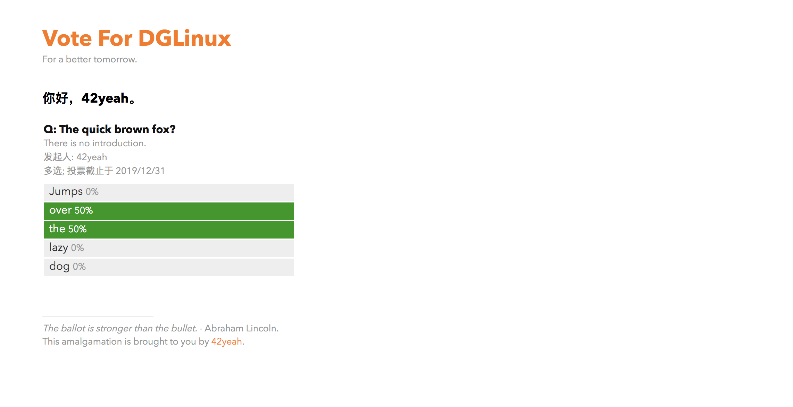

## Vote For DGLinux!

This is a voting system, as a test to run DGLinux in a democratic way, for the fellow member of DGLinux. It shall mostly work. It uses Github OAuth as a mean of verification and login, so a github account might be necessary.

### Start & Run

Clone and `npm install`. Then you can either `npm run server` or `node server.js`, doesn't matter.

```sh
git clone https://github.com/dglinux/vote-for-dglinux
cd vote-for-dglinux
npm install
npm run server
```

### Word of Notice

However, before `npm run server`, you should create a Github OAuth application [here](https://github.com/settings/applications/new). After the successful OAuth app creation, you can begin filling spaces in the file `server-config-template.json`, and later renaming it to `server-config.json`.

Also, the OAuth Application's redirection address should point to the home page of the voting system.

### Why is this stuff in Chinese?

Yeah that. You gotta translate it by yourself. Sorry.

### Then why is this README in English?

Yeah... You gotta translate this by yourself. Sorry.
